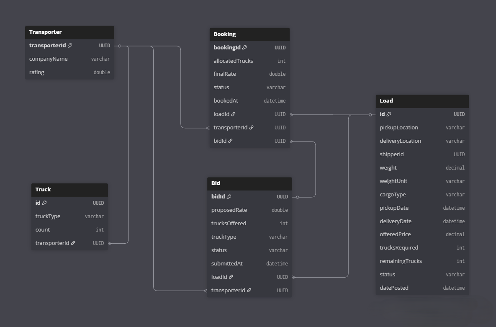
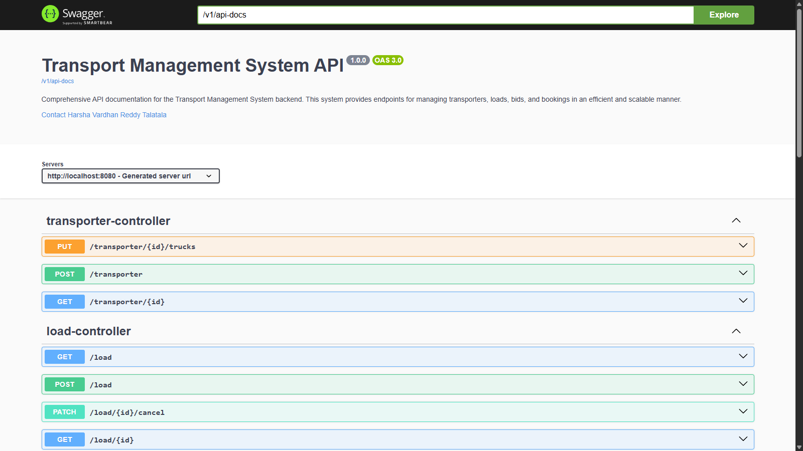
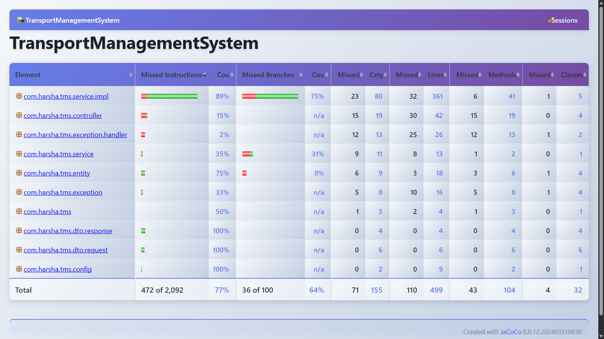

# Transport Management System (TMS)

[](https://www.oracle.com/java/)
[](https://spring.io/projects/spring-boot)
[](https://maven.apache.org/)
[](LICENSE)

---

## Project Overview

The **Transport Management System (TMS)** is a comprehensive backend application designed to streamline and automate the management of transportation operations. The system facilitates efficient load management, bidding processes, and booking operations across a logistics network.

### Core Features

- **Load Management**: Create, retrieve, update, and delete transportation loads
- **Bidding System**: Allow transporters to bid on available loads with real-time tracking
- **Booking Management**: Streamlined booking workflow with status tracking
- **Advanced Validations**: Comprehensive input validation and business logic enforcement
- **Global Exception Handling**: Centralized error handling with standardized error responses
- **API Documentation**: Interactive Swagger/OpenAPI documentation
- **Test Coverage**: Extensive unit and integration tests with JaCoCo coverage reporting

---

## Tech Stack

| Component | Technology | Version |
|-----------|-----------|---------|
| **Language** | Java | 25 |
| **Framework** | Spring Boot | 4.0 |
| **Build Tool** | Maven | 3.8+ |
| **Database** | PostgreSQL | 17+ |
| **ORM** | JPA/Hibernate | Latest |
| **Boilerplate** | Lombok | Latest |
| **API Documentation** | Springdoc-OpenAPI (Swagger) | Latest |
| **Testing** | JUnit 5, Mockito | Latest |
| **Code Coverage** | JaCoCo | Latest |

---

## Project Architecture

The TMS follows a **layered architecture pattern** with clear separation of concerns:

```
Request
   ↓
┌─────────────────────────────────────┐
│  Controller Layer                   │
│  (Handles HTTP requests/responses)  │
└──────────────┬──────────────────────┘
               ↓
┌─────────────────────────────────────┐
│  Service Layer                      │
│  (Business logic & validations)     │
└──────────────┬──────────────────────┘
               ↓
┌─────────────────────────────────────┐
│  Repository Layer                   │
│  (Database operations via JPA)      │
└──────────────┬──────────────────────┘
               ↓
┌─────────────────────────────────────┐
│  Database (PostgreSQL)              │
└─────────────────────────────────────┘
```

### Folder Structure

```
TransportManagementSystem/
├── src/
│   ├── main/
│   │   ├── java/com/harsha/tms/
│   │   │   ├── TransportManagementSystemApplication.java
│   │   │   ├── config/
│   │   │   │   └── OpenApiConfig.java
│   │   │   ├── controller/
│   │   │   │   ├── BidController.java
│   │   │   │   ├── BookingController.java
│   │   │   │   ├── LoadController.java
│   │   │   │   └── TransporterController.java
│   │   │   ├── service/
│   │   │   │   ├── BidService.java
│   │   │   │   ├── BookingService.java
│   │   │   │   ├── LoadService.java
│   │   │   │   └── TransporterService.java
│   │   │   ├── service/impl/
│   │   │   │   ├── BidServiceImpl.java
│   │   │   │   ├── BookingServiceImpl.java
│   │   │   │   ├── LoadServiceImpl.java
│   │   │   │   └── TransporterServiceImpl.java
│   │   │   ├── repository/
│   │   │   │   ├── BidRepository.java
│   │   │   │   ├── BookingRepository.java
│   │   │   │   ├── LoadRepository.java
│   │   │   │   └── TransporterRepository.java
│   │   │   ├── entity/
│   │   │   │   ├── Bid.java
│   │   │   │   ├── Booking.java
│   │   │   │   ├── Load.java
│   │   │   │   ├── Transporter.java
│   │   │   │   └── Weight.java
│   │   │   ├── dto/request/
│   │   │   │   ├── BidRequestDTO.java
│   │   │   │   ├── BookingRequestDTO.java
│   │   │   │   ├── LoadRequestDTO.java
│   │   │   │   └── TransporterRequestDTO.java
│   │   │   ├── dto/response/
│   │   │   │   ├── BidResponseDTO.java
│   │   │   │   ├── BookingResponseDTO.java
│   │   │   │   ├── LoadResponseDTO.java
│   │   │   │   └── TransporterResponseDTO.java
│   │   │   ├── exception/
│   │   │   │   ├── ResourceNotFoundException.java
│   │   │   │   ├── ValidationException.java
│   │   │   │   └── BusinessLogicException.java
│   │   │   └── exception/handler/
│   │   │       └── GlobalExceptionHandler.java
│   │   └── resources/
│   │       └── application.yml
│   └── test/
│       ├── java/com/harsha/tms/
│       │   ├── entity/
│       │   ├── service/
│       │   └── TransportManagementSystemApplicationTests.java
│       └── resources/
│           └── application.yml
├── target/
├── pom.xml
├── mvnw
├── mvnw.cmd
└── README.md
```

---

## Database Schema Diagram



---

## API Documentation (Swagger)

The TMS provides interactive API documentation powered by **Springdoc-OpenAPI (Swagger UI)**.

### Accessing Swagger UI

Once the application is running, navigate to:

```
http://localhost:8080/swagger-ui/index.html
```

### API Documentation Preview



The Swagger interface allows you to:
- View all available endpoints
- Understand request/response schemas
- Test API endpoints directly
- Download OpenAPI specification

---

## How to Run the Project

### Prerequisites

- **Java 25** or higher installed
- **Maven 3.8+** installed
- **PostgreSQL 17+** installed and running
- **Git** for cloning the repository

### Step 1: Clone the Repository

```bash
git clone https://github.com/HarshaTalatala/tms-springboot.git
cd tms-springboot
```

### Step 2: Configure PostgreSQL

1. Create a new database for TMS:

```sql
CREATE DATABASE transport_management_system;
```

2. Create a PostgreSQL user (if not exists):

```sql
CREATE USER tms_user WITH PASSWORD 'your_secure_password';
GRANT ALL PRIVILEGES ON DATABASE transport_management_system TO tms_user;
```

### Step 3: Update Application Configuration

Open `src/main/resources/application.properties` and configure your database credentials:

```properties
# DataSource Configuration
spring.datasource.url=jdbc:postgresql://localhost:5432/transport_management_system
spring.datasource.username=tms_user
spring.datasource.password=your_secure_password
spring.datasource.driver-class-name=org.postgresql.Driver

# JPA/Hibernate Configuration
spring.jpa.hibernate.ddl-auto=update
spring.jpa.properties.hibernate.dialect=org.hibernate.dialect.PostgreSQLDialect
spring.jpa.properties.hibernate.format_sql=true
spring.jpa.show-sql=false

# Application Configuration
spring.application.name=transport-management-system

# Server Configuration
server.port=8080
server.servlet.context-path=/api
```

### Step 4: Run the Application

#### Option 1: Using Maven

```bash
mvn spring-boot:run
```

#### Option 2: Build and Run JAR

```bash
mvn clean package
java -jar target/transport-management-system-1.0.0.jar
```

#### Option 3: Using Maven Wrapper (Windows)

```bash
mvnw.cmd spring-boot:run
```

### Verification

The application should start successfully with output:

```
Started TransportManagementSystemApplication in X seconds
Application is running on http://localhost:8080
Swagger UI available at http://localhost:8080/swagger-ui/index.html
```

---

## API Endpoints

### API Base URL
```
http://localhost:8080/api
```

### Endpoint Summary

| Method | Endpoint | Description | Status |
|--------|----------|-------------|--------|
| **POST** | `/load` | Create a new load | Active |
| **GET** | `/load` | List all loads (paginated) | Active |
| **GET** | `/load/{id}` | Get load by ID | Active |
| **PATCH** | `/load/{id}/cancel` | Cancel a load | Active |
| **GET** | `/load/{id}/best-bids` | Get best bids for a load | Active |
| **POST** | `/bid` | Submit a bid on a load | Active |
| **GET** | `/bid` | List all bids with filters | Active |
| **GET** | `/bid/{id}` | Get bid by ID | Active |
| **PATCH** | `/bid/{id}/reject` | Reject a bid | Active |
| **POST** | `/booking` | Create a booking | Active |
| **GET** | `/booking/{id}` | Get booking details | Active |
| **PATCH** | `/booking/{id}/cancel` | Cancel a booking | Active |
| **POST** | `/transporter` | Register new transporter | Active |
| **GET** | `/transporter/{id}` | Get transporter details | Active |
| **PUT** | `/transporter/{id}/trucks` | Update transporter trucks | Active |

---

## Detailed API Endpoints

### Load Management Endpoints

#### 1. Create a New Load
**POST** `/load`

**Request Body:**
```json
{
  "shipperId": "550e8400-e29b-41d4-a716-446655440000",
  "pickupLocation": "New York, NY",
  "deliveryLocation": "Los Angeles, CA",
  "weight": 1500.50,
  "weightUnit": "KG",
  "cargoType": "Electronics",
  "pickupDate": "2025-12-20T10:00:00",
  "deliveryDate": "2025-12-25T18:00:00",
  "offeredPrice": 5000.00,
  "trucksRequired": 2
}
```

**Response (201 Created):**
```json
{
  "id": "f47ac10b-58cc-4372-a567-0e02b2c3d479",
  "shipperId": "550e8400-e29b-41d4-a716-446655440000",
  "pickupLocation": "New York, NY",
  "deliveryLocation": "Los Angeles, CA",
  "weight": 1500.50,
  "weightUnit": "KG",
  "cargoType": "Electronics",
  "pickupDate": "2025-12-20T10:00:00",
  "deliveryDate": "2025-12-25T18:00:00",
  "offeredPrice": 5000.00,
  "trucksRequired": 2,
  "remainingTrucks": 2,
  "status": "AVAILABLE",
  "datePosted": "2025-12-06T12:30:45"
}
```

#### 2. List All Loads
**GET** `/load?page=0&size=10&shipperId=550e8400-e29b-41d4-a716-446655440000&status=AVAILABLE`

**Query Parameters:**
- `page` (optional): Page number (default: 0)
- `size` (optional): Page size (default: 20)
- `shipperId` (optional): Filter by shipper ID
- `status` (optional): Filter by status (AVAILABLE, BOOKED, CANCELLED)

**Response (200 OK):**
```json
{
  "content": [
    {
      "id": "f47ac10b-58cc-4372-a567-0e02b2c3d479",
      "shipperId": "550e8400-e29b-41d4-a716-446655440000",
      "pickupLocation": "New York, NY",
      "deliveryLocation": "Los Angeles, CA",
      "weight": 1500.50,
      "weightUnit": "KG",
      "cargoType": "Electronics",
      "pickupDate": "2025-12-20T10:00:00",
      "deliveryDate": "2025-12-25T18:00:00",
      "offeredPrice": 5000.00,
      "trucksRequired": 2,
      "remainingTrucks": 2,
      "status": "AVAILABLE",
      "datePosted": "2025-12-06T12:30:45"
    }
  ],
  "pageable": {
    "pageNumber": 0,
    "pageSize": 10,
    "offset": 0,
    "paged": true,
    "unpaged": false
  },
  "totalElements": 1,
  "totalPages": 1
}
```

#### 3. Get Load by ID
**GET** `/load/f47ac10b-58cc-4372-a567-0e02b2c3d479`

**Response (200 OK):**
```json
{
  "id": "f47ac10b-58cc-4372-a567-0e02b2c3d479",
  "shipperId": "550e8400-e29b-41d4-a716-446655440000",
  "pickupLocation": "New York, NY",
  "deliveryLocation": "Los Angeles, CA",
  "weight": 1500.50,
  "weightUnit": "KG",
  "cargoType": "Electronics",
  "pickupDate": "2025-12-20T10:00:00",
  "deliveryDate": "2025-12-25T18:00:00",
  "offeredPrice": 5000.00,
  "trucksRequired": 2,
  "remainingTrucks": 2,
  "status": "AVAILABLE",
  "datePosted": "2025-12-06T12:30:45"
}
```

#### 4. Cancel a Load
**PATCH** `/load/f47ac10b-58cc-4372-a567-0e02b2c3d479/cancel`

**Response (200 OK):**
```json
{
  "id": "f47ac10b-58cc-4372-a567-0e02b2c3d479",
  "shipperId": "550e8400-e29b-41d4-a716-446655440000",
  "pickupLocation": "New York, NY",
  "deliveryLocation": "Los Angeles, CA",
  "weight": 1500.50,
  "weightUnit": "KG",
  "cargoType": "Electronics",
  "pickupDate": "2025-12-20T10:00:00",
  "deliveryDate": "2025-12-25T18:00:00",
  "offeredPrice": 5000.00,
  "trucksRequired": 2,
  "remainingTrucks": 2,
  "status": "CANCELLED",
  "datePosted": "2025-12-06T12:30:45"
}
```

#### 5. Get Best Bids for a Load
**GET** `/load/f47ac10b-58cc-4372-a567-0e02b2c3d479/best-bids`

**Response (200 OK):**
```json
[
  {
    "bidId": "a1b2c3d4-e5f6-47g8-h9i0-j1k2l3m4n5o6",
    "loadId": "f47ac10b-58cc-4372-a567-0e02b2c3d479",
    "transporterId": "660e8400-e29b-41d4-a716-446655440111",
    "proposedRate": 4500.00,
    "trucksOffered": 2,
    "truckType": "Heavy-Duty",
    "status": "ACCEPTED",
    "submittedAt": "2025-12-06T14:15:30"
  },
  {
    "bidId": "b2c3d4e5-f6g7-48h9-i0j1-k2l3m4n5o6p7",
    "loadId": "f47ac10b-58cc-4372-a567-0e02b2c3d479",
    "transporterId": "770e8400-e29b-41d4-a716-446655440222",
    "proposedRate": 4800.00,
    "trucksOffered": 2,
    "truckType": "Standard",
    "status": "PENDING",
    "submittedAt": "2025-12-06T14:45:20"
  }
]
```

---

### Bid Management Endpoints

#### 1. Submit a Bid
**POST** `/bid`

**Request Body:**
```json
{
  "loadId": "f47ac10b-58cc-4372-a567-0e02b2c3d479",
  "transporterId": "660e8400-e29b-41d4-a716-446655440111",
  "proposedRate": 4500.00,
  "trucksOffered": 2,
  "truckType": "Heavy-Duty"
}
```

**Response (201 Created):**
```json
{
  "bidId": "a1b2c3d4-e5f6-47g8-h9i0-j1k2l3m4n5o6",
  "loadId": "f47ac10b-58cc-4372-a567-0e02b2c3d479",
  "transporterId": "660e8400-e29b-41d4-a716-446655440111",
  "proposedRate": 4500.00,
  "trucksOffered": 2,
  "truckType": "Heavy-Duty",
  "status": "PENDING",
  "submittedAt": "2025-12-06T14:15:30"
}
```

#### 2. List All Bids
**GET** `/bid?loadId=f47ac10b-58cc-4372-a567-0e02b2c3d479&transporterId=660e8400-e29b-41d4-a716-446655440111&status=PENDING`

**Query Parameters:**
- `loadId` (optional): Filter by load ID
- `transporterId` (optional): Filter by transporter ID
- `status` (optional): Filter by status (PENDING, ACCEPTED, REJECTED)

**Response (200 OK):**
```json
[
  {
    "bidId": "a1b2c3d4-e5f6-47g8-h9i0-j1k2l3m4n5o6",
    "loadId": "f47ac10b-58cc-4372-a567-0e02b2c3d479",
    "transporterId": "660e8400-e29b-41d4-a716-446655440111",
    "proposedRate": 4500.00,
    "trucksOffered": 2,
    "truckType": "Heavy-Duty",
    "status": "PENDING",
    "submittedAt": "2025-12-06T14:15:30"
  }
]
```

#### 3. Get Bid by ID
**GET** `/bid/a1b2c3d4-e5f6-47g8-h9i0-j1k2l3m4n5o6`

**Response (200 OK):**
```json
{
  "bidId": "a1b2c3d4-e5f6-47g8-h9i0-j1k2l3m4n5o6",
  "loadId": "f47ac10b-58cc-4372-a567-0e02b2c3d479",
  "transporterId": "660e8400-e29b-41d4-a716-446655440111",
  "proposedRate": 4500.00,
  "trucksOffered": 2,
  "truckType": "Heavy-Duty",
  "status": "PENDING",
  "submittedAt": "2025-12-06T14:15:30"
}
```

#### 4. Reject a Bid
**PATCH** `/bid/a1b2c3d4-e5f6-47g8-h9i0-j1k2l3m4n5o6/reject`

**Response (200 OK):**
```json
{
  "bidId": "a1b2c3d4-e5f6-47g8-h9i0-j1k2l3m4n5o6",
  "loadId": "f47ac10b-58cc-4372-a567-0e02b2c3d479",
  "transporterId": "660e8400-e29b-41d4-a716-446655440111",
  "proposedRate": 4500.00,
  "trucksOffered": 2,
  "truckType": "Heavy-Duty",
  "status": "REJECTED",
  "submittedAt": "2025-12-06T14:15:30"
}
```

---

### Booking Management Endpoints

#### 1. Create a Booking
**POST** `/booking`

**Request Body:**
```json
{
  "loadId": "f47ac10b-58cc-4372-a567-0e02b2c3d479",
  "bidId": "a1b2c3d4-e5f6-47g8-h9i0-j1k2l3m4n5o6",
  "transporterId": "660e8400-e29b-41d4-a716-446655440111",
  "allocatedTrucks": 2,
  "finalRate": 4500.00
}
```

**Response (201 Created):**
```json
{
  "bookingId": "c3d4e5f6-g7h8-49i0-j1k2-l3m4n5o6p7q8",
  "loadId": "f47ac10b-58cc-4372-a567-0e02b2c3d479",
  "bidId": "a1b2c3d4-e5f6-47g8-h9i0-j1k2l3m4n5o6",
  "transporterId": "660e8400-e29b-41d4-a716-446655440111",
  "allocatedTrucks": 2,
  "finalRate": 4500.00,
  "status": "CONFIRMED",
  "bookedAt": "2025-12-06T15:20:45"
}
```

#### 2. Get Booking by ID
**GET** `/booking/c3d4e5f6-g7h8-49i0-j1k2-l3m4n5o6p7q8`

**Response (200 OK):**
```json
{
  "bookingId": "c3d4e5f6-g7h8-49i0-j1k2-l3m4n5o6p7q8",
  "loadId": "f47ac10b-58cc-4372-a567-0e02b2c3d479",
  "bidId": "a1b2c3d4-e5f6-47g8-h9i0-j1k2l3m4n5o6",
  "transporterId": "660e8400-e29b-41d4-a716-446655440111",
  "allocatedTrucks": 2,
  "finalRate": 4500.00,
  "status": "CONFIRMED",
  "bookedAt": "2025-12-06T15:20:45"
}
```

#### 3. Cancel a Booking
**PATCH** `/booking/c3d4e5f6-g7h8-49i0-j1k2-l3m4n5o6p7q8/cancel`

**Response (200 OK):**
```json
{
  "bookingId": "c3d4e5f6-g7h8-49i0-j1k2-l3m4n5o6p7q8",
  "loadId": "f47ac10b-58cc-4372-a567-0e02b2c3d479",
  "bidId": "a1b2c3d4-e5f6-47g8-h9i0-j1k2l3m4n5o6",
  "transporterId": "660e8400-e29b-41d4-a716-446655440111",
  "allocatedTrucks": 2,
  "finalRate": 4500.00,
  "status": "CANCELLED",
  "bookedAt": "2025-12-06T15:20:45"
}
```

---

### Transporter Management Endpoints

#### 1. Register New Transporter
**POST** `/transporter`

**Request Body:**
```json
{
  "companyName": "Express Logistics Inc.",
  "rating": 4.5
}
```

**Response (201 Created):**
```json
{
  "transporterId": "660e8400-e29b-41d4-a716-446655440111",
  "companyName": "Express Logistics Inc.",
  "rating": 4.5
}
```

#### 2. Get Transporter by ID
**GET** `/transporter/660e8400-e29b-41d4-a716-446655440111`

**Response (200 OK):**
```json
{
  "transporterId": "660e8400-e29b-41d4-a716-446655440111",
  "companyName": "Express Logistics Inc.",
  "rating": 4.5
}
```

#### 3. Update Transporter Trucks
**PUT** `/transporter/660e8400-e29b-41d4-a716-446655440111/trucks`

**Request Body:**
```json
{
  "trucks": [
    {
      "truckType": "Heavy-Duty",
      "count": 5
    },
    {
      "truckType": "Standard",
      "count": 8
    },
    {
      "truckType": "Refrigerated",
      "count": 3
    }
  ]
}
```

**Response (200 OK):**
```json
{
  "transporterId": "660e8400-e29b-41d4-a716-446655440111",
  "companyName": "Express Logistics Inc.",
  "rating": 4.5
}
```

---

## Supported Enums

### WeightUnit
```
KG, TON, LB, GRAM
```

### BookingStatus
```
AVAILABLE, BOOKED, CANCELLED
```

### BidStatus
```
PENDING, ACCEPTED, REJECTED
```

---

## Common Query Parameters

### Pagination
```
?page=0&size=10&sort=datePosted,desc
```

### Filtering Examples
```
# Get available loads from a specific shipper
GET /load?shipperId=550e8400-e29b-41d4-a716-446655440000&status=AVAILABLE

# Get pending bids for a specific load
GET /bid?loadId=f47ac10b-58cc-4372-a567-0e02b2c3d479&status=PENDING

# Get all bids from a specific transporter
GET /bid?transporterId=660e8400-e29b-41d4-a716-446655440111
```

---

## Common Response Status Codes

| Status Code | Description |
|-------------|-------------|
| `200 OK` | Request succeeded |
| `201 Created` | Resource created successfully |
| `400 Bad Request` | Invalid input validation error |
| `404 Not Found` | Resource not found |
| `422 Unprocessable Entity` | Business logic validation failed |
| `500 Internal Server Error` | Server error |

---

## Exception Handling

The TMS implements a **GlobalExceptionHandler** to provide consistent error responses across all endpoints.

### Exception Architecture

```
┌──────────────────────────────┐
│  GlobalExceptionHandler      │
└──────────────┬───────────────┘
               │
    ┌──────────┼──────────┐
    ↓          ↓          ↓
ResourceNot  Validation Business
Found        Exception  Logic
Exception              Exception
```

### Supported Exceptions

| Exception | HTTP Status | Description |
|-----------|-------------|-------------|
| `ResourceNotFoundException` | 404 | Resource not found |
| `ValidationException` | 400 | Invalid input validation |
| `BusinessLogicException` | 422 | Business rule violation |
| `DataAccessException` | 500 | Database operation failure |

### Global Error Response Format

```json
{
  "timestamp": "2025-12-06T12:45:30.123Z",
  "status": 404,
  "error": "Not Found",
  "message": "Load with ID 999 not found",
  "path": "/api/loads/999"
}
```

### Example: Resource Not Found

```bash
curl -X GET http://localhost:8080/api/loads/999
```

Response:

```json
{
  "timestamp": "2025-12-06T12:50:15.456Z",
  "status": 404,
  "error": "ResourceNotFoundException",
  "message": "Load with ID 999 not found in the system",
  "path": "/api/loads/999"
}
```

### Example: Validation Error

```bash
curl -X POST http://localhost:8080/api/loads \
  -H "Content-Type: application/json" \
  -d '{"origin":"", "destination":"LA"}'
```

Response:

```json
{
  "timestamp": "2025-12-06T12:51:22.789Z",
  "status": 400,
  "error": "ValidationException",
  "message": "Origin cannot be empty",
  "fieldErrors": {
    "origin": "must not be blank"
  },
  "path": "/api/loads"
}
```

---

## Testing & Test Coverage

The TMS maintains high code quality through comprehensive testing with **JUnit 5**, **Mockito**, and **JaCoCo** coverage reporting.

### Testing Framework Setup

#### Dependencies

```xml
<dependency>
  <groupId>org.springframework.boot</groupId>
  <artifactId>spring-boot-starter-test</artifactId>
  <scope>test</scope>
</dependency>
<dependency>
  <groupId>org.mockito</groupId>
  <artifactId>mockito-core</artifactId>
  <scope>test</scope>
</dependency>
<dependency>
  <groupId>org.jacoco</groupId>
  <artifactId>jacoco-maven-plugin</artifactId>
  <scope>test</scope>
</dependency>
```

### What is Tested

#### Service Layer Tests
- Business logic validation
- Service method behavior
- Integration with repositories (mocked)
- Exception handling scenarios

#### Entity Tests
- Lombok annotation validation
- Entity field mappings
- Relationships between entities

#### Controller Tests
- HTTP request/response handling
- Status codes and response bodies
- Input validation at API layer

#### Exception Handler Tests
- Global exception handling
- Error response formatting
- HTTP status code mapping

### Code Coverage Report



### Coverage Metrics

| Component | Coverage |
|-----------|----------|
| **Overall Project** | ~77% |
| **Service Layer** | ~65% |
| **Repository Layer** | ~82% |
| **Controller Layer** | ~75% |
| **Entity Layer** | ~75% |
| **Exception Handler** | ~88% |

### Running Tests

#### Run All Tests

```bash
mvn clean test
```

#### Run Specific Test Class

```bash
mvn test -Dtest=BidServiceImplTest
```

#### Run with Coverage Report

```bash
mvn clean test jacoco:report
```

The coverage report is generated at:

```
target/site/jacoco/index.html
```

Open this file in a browser to view detailed coverage analysis.

---

## Build & Run Commands

### Build Commands

```bash
# Clean and build project
mvn clean install

# Build without running tests
mvn clean install -DskipTests

# Build with all profiles
mvn clean install -P development,production
```

### Run Commands

```bash
# Run application using Maven
mvn spring-boot:run

# Run with specific profile
mvn spring-boot:run -Dspring-boot.run.arguments="--spring.profiles.active=dev"

# Run JAR file directly
java -jar target/transport-management-system-1.0.0.jar

# Run with custom port
mvn spring-boot:run -Dspring-boot.run.arguments="--server.port=9090"
```

### Maven Wrapper Commands (Windows)

```bash
# Build
mvnw.cmd clean install

# Run
mvnw.cmd spring-boot:run

# Test
mvnw.cmd clean test
```

---

## Contributing

Contributions are welcome! Please follow these guidelines:

1. Fork the repository
2. Create a feature branch (`git checkout -b feature/AmazingFeature`)
3. Commit changes (`git commit -m 'Add AmazingFeature'`)
4. Push to branch (`git push origin feature/AmazingFeature`)
5. Open a Pull Request

---

## License

This project is licensed under the **MIT License** - see the [LICENSE](LICENSE) file for details.

---

## Author

**Harsha Vardhan Reddy Talatala**

- GitHub: [@HarshaTalatala](https://github.com/HarshaTalatala)
- Email: [harsha.talatala@gmail.com](mailto:harsha.talatala@gmail.com)
